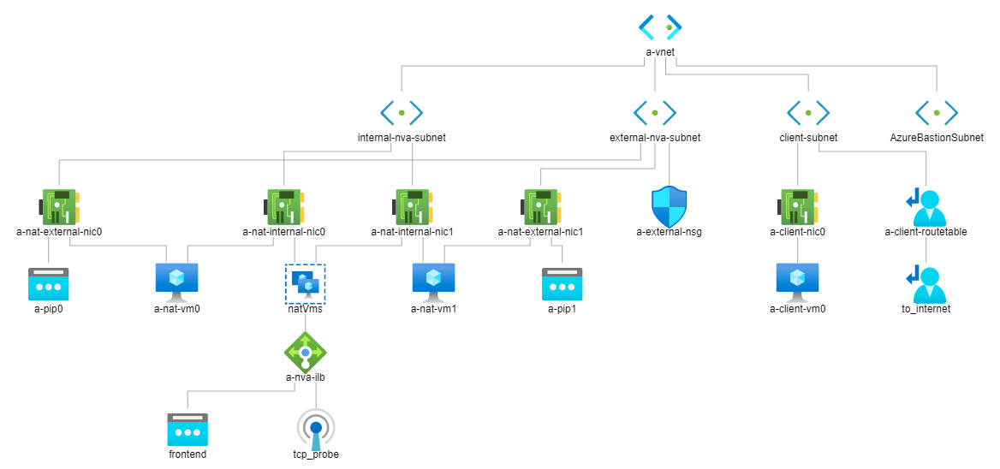
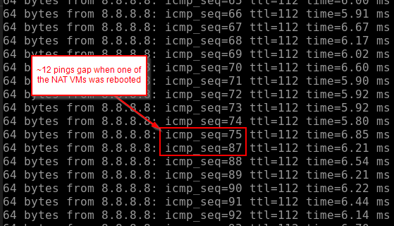

# Simple NAT using 2 VMs behind Azure Standard Load Balancer with HA ports

Test simple NAT consisting of two Ubuntu 18.04-LTS VMs in an Availability Set behind an internal [Azure Standard Load Balancer with HA ports](https://docs.microsoft.com/en-us/azure/load-balancer/load-balancer-ha-ports-overview)

The template deploys the following resources in about 5 minutes:

* 1 Virtual Network with 4 subnets: AzureBastionSubnet, nva-external-subnet, nva-internal-subnet, client-subnet
* 1 Azure Bastion in the VNet for SSH connectivity to the client VM
* 2 Public IPs for the NAT VMs
* 1 Availability Set
* 2 NAT VMs (Standard_DS2_v2 with Ubuntu 18.04-LTS) in the Availability Set with 2 NICs in nva-external-subnet and nva-internal-subnet
* 1 Standard Load Balancer with [HA ports rule](https://docs.microsoft.com/en-us/azure/load-balancer/load-balancer-ha-ports-overview) and frontend IP in nva-internal-subnet using SSH port 22 as health probe
* 1 Route Table with 0.0.0.0/0 rule pointing to the Load Balancer frontend IP
* 1 test client VM (Standard_DS2_v2 with Ubuntu 18.04-LTS) with 1 NIC in client-subnet

## VNet Topology



## Create a resource group and deploy the resources using the template

```bash
az account set --subscription "SUBSCRIPTION_ID"

az group create --name a --location eastus2

az deployment group create --resource-group a --template-file nat-vms-template.json --parameters prefix=a
```

## Use Azure Bastion to SSH into each of the NAT VMs to simple iptables NAT

[Azure assigns default gateway only to the primary NIC attached to the VM](https://docs.microsoft.com/en-us/azure/virtual-machines/windows/multiple-nics#configure-guest-os-for-multiple-nics), so need to assign a static route to the secondary NIC for it to communicate with resources outside of its subnet.

> NOTE: For testing, this configuration is not persistent across reboots.

```bash
# Root
sudo -i

# Add route to client-subnet from secondary (internal) NIC eth1 instead of primary (external) NIC eth0
route add -net 10.100.3.0 netmask 255.255.255.0 gw 10.100.2.1 dev eth1

# Add route for responding to load balancer probes on eth1
route add -net 168.63.129.16 netmask 255.255.255.255 gw 10.100.2.1 dev eth1

# Print route table to confirm
route -n

# Turn on kernel IP-forwarding
echo "1" > /proc/sys/net/ipv4/ip_forward

# Add iptables NAT rules
iptables -t nat -A POSTROUTING -o eth0 -j MASQUERADE
iptables -A FORWARD -i eth0 -o eth1 -m state --state RELATED,ESTABLISHED -j ACCEPT
iptables -A FORWARD -i eth1 -o eth0 -j ACCEPT
```

## Ping test from client VM

```bash
ping 8.8.8.8
```

## See pings and SSH flowing through NAT VM eth1 (internal) and eth0 (external)

```bash
sudo tcpdump -i eth1 -n

sudo tcpdump -p icmp -i eth0 -n
```

## Test Failover

Restart one of the NAT VMs and confirm that client ping continues with small interruption of about ~10 seconds for health probe to detect VM is down (2 failed tests 5 seconds apart)

The gap in pings from client VM during one of the NAT VM reboots looks like this

